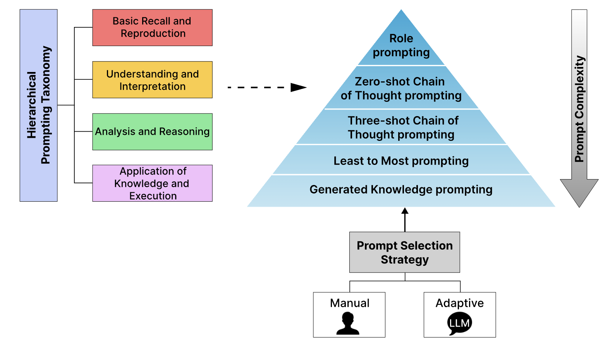

<p align="center">
  
  
  
  
</p>


<div align="center">
  <div style="display: flex; align-items: center; justify-content: center;">
    <a href="https://github.com/devichand579/HPT">
      
    </a>
    <span style="font-size: 225px; font-weight: bold; margin-left: 10px;">
      <h1><strong>Hierarchical Prompting Taxonomy</strong></h1>
    </span>
  </div>
  <div style="margin-top: 10px;">
    <a href="">Paper</a>
    ·
    <a href="">Documentation</a>
    ·
    <a href="">Leaderboard</a>
  </div>
  <div style="font-size: 1.5em; font-weight: bold; margin-top: 10px;">
    <strong>A Universal Evaluation Framework for Large Language Models</strong>
  </div>
</div>

<!-- TABLE OF CONTENTS -->

<details>
  <summary>Table of Contents</summary>
  <ol>
    <li><a href="#news">News</a></li>
    <li><a href="#introduction">Introduction</a></li>
    <li><a href="#demo">Demo</a></li>
    <li><a href="#installation">Installation</a></li>
    <li><a href="#usage">Usage</a></li>
    <li><a href="#supported-datasets-and-models">Datasets and Models</a></li>
    <li><a href="#benchmark-results">Benchmark Results</a></li>
    <li><a href="#references">References</a></li>
    <li><a href="#contributing">Contributing</a></li>
    <li><a href="#cite-us">Cite Us</a></li>
  </ol>
</details>

## News
## Introduction
**Hierarchical Prompting Taxonomy** (HPT) is a universal evaluation framework for large language models. It is designed to evaluate the performance of large language models on a variety of tasks and datasets assigning **HP-Score** for each dataset relative to different models. The HPT employs **Hierarchical Prompt Framework** (HPF) which supports a wide range of tasks, including question-answering, reasoning, translation, and summarization, and provides a set of pre-defined prompts tailored for for each task based on it's complexity. Refer to paper at : [Paper](..)

### Features of HPT and HPF
## Demo
Refer to [examples](./examples/) directory for using the framework on different datasets and models.
## Installation
### pip install
To install the package, run the following command:
```sh
pip install hpt
```
### Cloning the Repository
To clone the repository, run the following command:
```sh
git clone https://github.com/devichand579/HPT.git
```
## Usage
### Linux
To get started on a linux setup, follow these setup commands:
1. **Activate your conda environment:**
    ```sh
    conda activate hpt
    ```
3. **Navigate to the main codebase**
   ```sh
   cd HPT/hierarchical_prompt
   ```
   
3. **Install the dependencies**
   ```sh
   pip install -r requirements.txt
   ```
4. **Add your Hugging Face token**
   - Create a .env file in the conda environment
   ```sh
   HF_TOKEN = "your HF Token"
   ```

5. **To run both the frameworks, use the following command structure**
    ```sh
    bash run.sh method model dataset [--thres num]
    ```
    - method
      - man
      - auto
        
    - model
        - llama3
        - phi3
        - gemma
        - mistral
        
    - dataset
        - boolq
        - csqa
        - iwslt
        - samsum
        
     - If the datasets are IWSLT or SamSum, add '--thres num'

    - num
        - 0.15
        - 0.20
        
    - Example commands: 
      ```sh
      bash run.sh man llama3 iwslt --thres 0.15
      ```
      ```sh
      bash run.sh auto phi3 boolq 
      ```
## Datasets and models 
HPT currently supports different datasets, models and prompt engineering methods employed by HPF. You are welcome to add more.
### Datasets

- Question-answering datasets:
  - BoolQ
- Reasoning datasets:
  - CommonsenseQA
- Translation datasets:
  - IWSLT-2017
- Summarization datasets:
  - SamSum


### Models

- Language models:
  - Llama 3 8B
  - Mistral 7B
  - Phi 3 3.8B
  - Gemma 7B


### Prompt Engineering

- Role Prompting
- Zero-shot Chain-of-Thought Prompting
- Three-shot Chain-of-Thought Prompting
- Least-to-Most Prompting
- Generated Knowledge Prompting
## Benchmark Results
## References 
## Contributing 
## Cite Us


