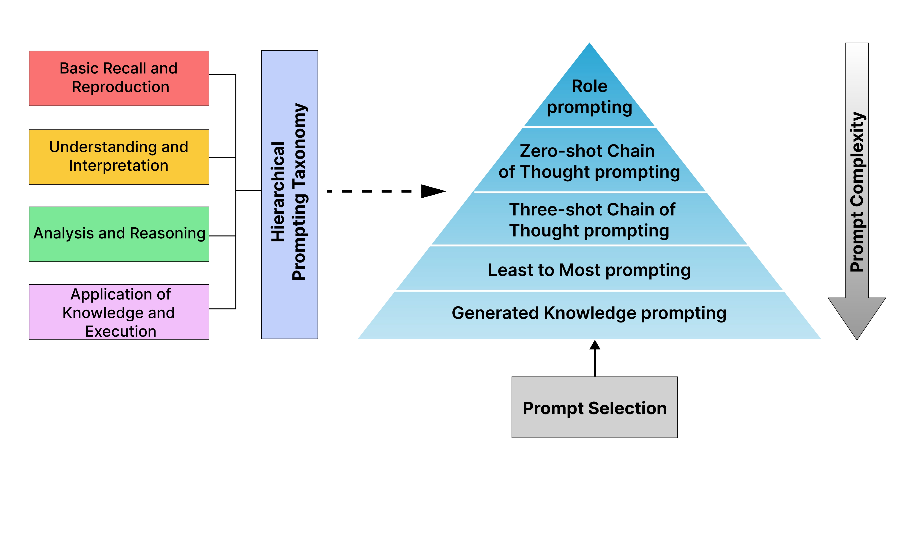

<a name="readme-top"></a>
<!-- <p align="center">
  
  
  
  
</p> -->

<div align="center">
  <div style="display: flex; align-items: center; justify-content: center;">
    <a href="https://github.com/devichand579/HPT">
      
    </a>
    <span style="font-size: 225px; font-weight: bold; margin-left: 10px;">
      <h1><strong>Hierarchical Prompting Taxonomy</strong></h1>
    </span>
  </div>
  <div style="font-size: 1.5em; font-weight: bold; margin-top: 10px;">
    <strong>A Universal Evaluation Framework for Large Language Models Aligned with Human Cognitive Principles</strong>
  </div>
  <div style="margin-top: 10px;">
    <a href="https://arxiv.org/abs/2406.12644">Paper</a>
  </div>
</div>

<!-- TABLE OF CONTENTS -->

<details>
  <summary>Table of Contents</summary>
  <ol>
    <li><a href="#news">News</a></li>
    <li><a href="#introduction">Introduction</a></li>
    <li><a href="#demo">Demo</a></li>
    <li><a href="#installation">Installation</a></li>
    <li><a href="#usage">Usage</a></li>
    <li><a href="#Datasets and models">Datasets and Models</a></li>
    <li><a href="#references">References</a></li>
    <li><a href="#contributing">Contributing</a></li> 
    <li><a href="#cite-us">Cite Us</a></li>
  </ol>
</details>

## News
- [07-20-25] HPT is accepted to KDD workshop on Prompt Optimization 2025 ! Check out the presentation [here](https://kdd-prompt-optimization-workshop.github.io/kdd-2025-prompt-optimization/) 🔥!
- [02-26-25] HPT is accepted to AAAI 2025 CogSci-AI Bridge ! Check out the presentation [here](https://sites.google.com/view/cosainsai/home-page).
- [06-18-24] HPT is published ! Check out the paper [here](https://arxiv.org/abs/2406.12644).

<p align="right" style="font-size: 14px; color: #555; margin-top: 20px;">
  <a href="#readme-top" style="text-decoration: none; color: blue; font-weight: bold;">
    ↑ Back to Top ↑
  </a>
</p>

## Introduction
- **Hierarchical Prompting Taxonomy** is a set of rules that maps prompting strategies onto human cognitive principles, enabling a universal measure of task complexity for LLMs.
- **Hierarchical Prompting Framework** is a framework designed to choose the most effective prompt from five distinct prompting strategies, minimizing cognitive load on LLMs for task resolution. This framework allows for a more accurate evaluation of LLMs and delivers more transparent insights.
- **Hierarchical Prompting Index**  quantitatively evaluates task complexity of LLMs across various datasets, offering insights into the cognitive demands each task imposes on different LLMs.





<p align="right" style="font-size: 14px; color: #555; margin-top: 20px;">
  <a href="#readme-top" style="text-decoration: none; color: blue; font-weight: bold;">
    ↑ Back to Top ↑
  </a>
</p>


## Usage
After Cloning the Repository
### Linux
To get started on a Linux setup, follow these setup commands:
1. **Activate your conda environment:**
    ```sh
    conda activate hpt
    ```
3. **Navigate to the main codebase**
   ```sh
   cd HPT/hierarchical_prompt
   ```
   
3. **Install the dependencies**
   ```sh
   pip install -r requirements.txt
   ```
4. **Add required APIs**
   - Create a .env file in the conda environment
   ```sh
   HF_TOKEN = "your HF Token"
   OPENAI_API_KEY = "your API key"
   ANTHROPIC_API_KEY = "your API key"
   ```

5. **To run both frameworks, use the following command structure**
    ```sh
    bash run.sh method model dataset [--thres num]
    ```
    - method
      - man
      - auto
        
    - model
        - gpt4o
        - claude
        - gemma2
        - nemo
        - llama3
        - phi3
        - gemma
        - mistral
        
    - dataset
        - mmlu
        - gsm8k
        - humaneval
        - boolq
        - csqa
        - iwslt
        - samsum
        
     - If the datasets are IWSLT or SamSum, add '--thres num'

    - num
        - 0.15
        - 0.20
        - 0.25
        - 0.30
        - or higher thresholds apart from our experiments.
    - Example commands: 
      ```sh
      bash run.sh man llama3 iwslt --thres 0.15
      ```
      ```sh
      bash run.sh auto phi3 boolq 
      ```
## To Run LLM-as-a-judge Experiment
1. **Naviage to prompt_complexity directory**
    ```sh
      cd HPT/prompt_complexity
    ```
2. **Run the prompt_complexity script**
    ```sh
      python prompt_complexity.py
    ```

<p align="right" style="font-size: 14px; color: #555; margin-top: 20px;">
  <a href="#readme-top" style="text-decoration: none; color: blue; font-weight: bold;">
    ↑ Back to Top ↑
  </a>
</p>

## Datasets and models 
HPT currently supports different datasets, models and prompt engineering methods employed by HPF. You are welcome to add more.
### Datasets

- Reasoning datasets:
  - MMLU
  - CommonsenseQA
- Coding datasets:
  - HumanEval
- Mathematics datasets:
  - GSM8K
- Question-answering datasets:
  - BoolQ
- Translation datasets:
  - IWSLT-2017 en-fr
- Summarization datasets:
  - SamSum


### Models

- Language models:
  - GPT-4o
  - Claude 3.5 Sonnet
  - Mistral Nemo 12B
  - Gemma 2 9B
  - Llama 3 8B
  - Mistral 7B
  - Phi 3 3.8B
  - Gemma 7B

### Prompt Engineering

- Role Prompting [1]
- Zero-shot Chain-of-Thought Prompting [2]
- Three-shot Chain-of-Thought Prompting [3]
- Least-to-Most Prompting [4]
- Generated Knowledge Prompting [5]

<p align="right" style="font-size: 14px; color: #555; margin-top: 20px;">
  <a href="#readme-top" style="text-decoration: none; color: blue; font-weight: bold;">
    ↑ Back to Top ↑
  </a>
</p>


## References 
1. Kong, A., Zhao, S., Chen, H., Li, Q., Qin, Y., Sun, R., & Zhou, X. (2023). Better Zero-Shot Reasoning with Role-Play Prompting. ArXiv, abs/2308.07702.
2. Kojima, T., Gu, S.S., Reid, M., Matsuo, Y., & Iwasawa, Y. (2022). Large Language Models are Zero-Shot Reasoners. ArXiv, abs/2205.11916.
3. Wei, J., Wang, X., Schuurmans, D., Bosma, M., Chi, E.H., Xia, F., Le, Q., & Zhou, D. (2022). Chain of Thought Prompting Elicits Reasoning in Large Language Models. ArXiv, abs/2201.11903.
4. Zhou, D., Scharli, N., Hou, L., Wei, J., Scales, N., Wang, X., Schuurmans, D., Bousquet, O., Le, Q., & Chi, E.H. (2022). Least-to-Most Prompting Enables Complex Reasoning in Large Language Models. ArXiv, abs/2205.10625.
5. Liu, J., Liu, A., Lu, X., Welleck, S., West, P., Le Bras, R., Choi, Y., & Hajishirzi, H. (2021). Generated Knowledge Prompting for Commonsense Reasoning. Annual Meeting of the Association for Computational Linguistics.
<p align="right" style="font-size: 14px; color: #555; margin-top: 20px;">
  <a href="#readme-top" style="text-decoration: none; color: blue; font-weight: bold;">
    ↑ Back to Top ↑
  </a>
</p>


## Contributing 
This project aims to build open-source evaluation frameworks for assessing LLMs and other agents. This project welcomes contributions and suggestions. Please see the details on [how to contribute](CONTRIBUTING.md).

If you are new to GitHub, [here](https://opensource.guide/how-to-contribute/#how-to-submit-a-contribution) is a detailed guide on getting involved with development on GitHub.
<p align="right" style="font-size: 14px; color: #555; margin-top: 20px;">
  <a href="#readme-top" style="text-decoration: none; color: blue; font-weight: bold;">
    ↑ Back to Top ↑
  </a>
</p>

## Cite Us
If you find our work useful, please cite us !
```bibtex
@misc{budagam2024hierarchicalpromptingtaxonomyuniversal,
      title={Hierarchical Prompting Taxonomy: A Universal Evaluation Framework for Large Language Models Aligned with Human Cognitive Principles}, 
      author={Devichand Budagam and Ashutosh Kumar and Mahsa Khoshnoodi and Sankalp KJ and Vinija Jain and Aman Chadha},
      year={2024},
      eprint={2406.12644},
      archivePrefix={arXiv},
      primaryClass={cs.CL},
      url={https://arxiv.org/abs/2406.12644}, 
}
```
<p align="right" style="font-size: 14px; color: #555; margin-top: 20px;">
  <a href="#readme-top" style="text-decoration: none; color: blue; font-weight: bold;">
    ↑ Back to Top ↑
  </a>
</p>


